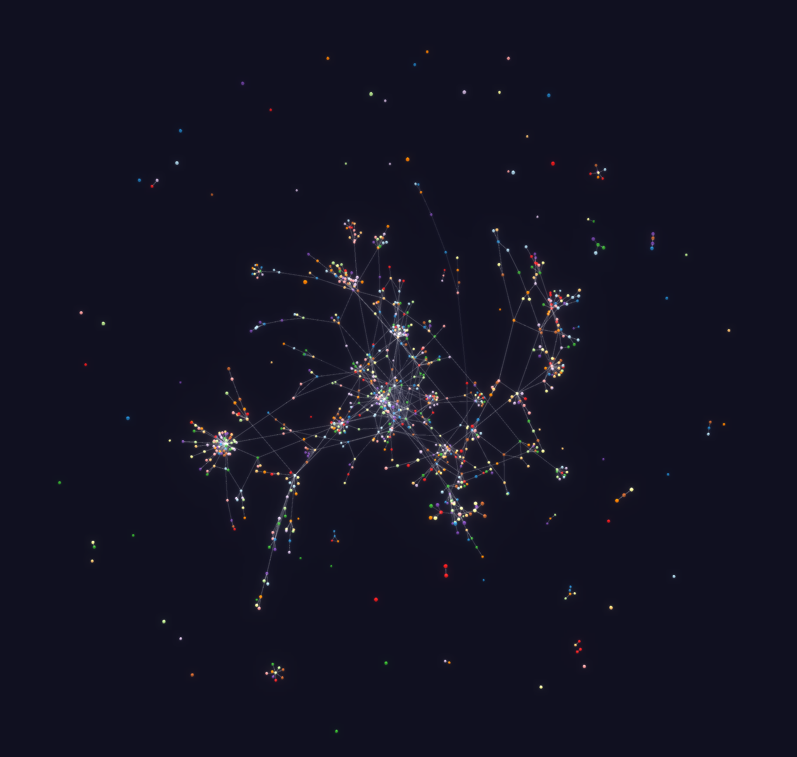

<!--
*** Thanks for checking out the Best-README-Template. If you have a suggestion
*** that would make this better, please fork the repo and create a pull request
*** or simply open an issue with the tag "enhancement".
*** Thanks again! Now go create something AMAZING! :D
***
***
***
*** To avoid retyping too much info. Do a search and replace for the following:
*** github_username, repo_name, twitter_handle, email, project_title, project_description
-->

<!-- PROJECT SHIELDS -->
<!--
*** I'm using markdown "reference style" links for readability.
*** Reference links are enclosed in brackets [ ] instead of parentheses ( ).
*** See the bottom of this document for the declaration of the reference variables
*** for contributors-url, forks-url, etc. This is an optional, concise syntax you may use.
*** https://www.markdownguide.org/basic-syntax/#reference-style-links
-->
[![Contributors][contributors-shield]][contributors-url]
[![Forks][forks-shield]][forks-url]
[![Stargazers][stars-shield]][stars-url]
[![Issues][issues-shield]][issues-url]
[![AGPLv3 License][license-shield]][license-url]

<!-- PROJECT LOGO -->
 

  

  <h3 align="center">Server_Stats Voyager Bot</h3>

  

    A bot running trough the matrix network to find all rooms.
     
    <a href="https://serverstats.nordgedanken.dev/"><strong>Explore the graph »</strong></a>
     
     
    <a href="https://github.com/MTRNord/server_stats/issues">Report Bug</a>
    ·
    <a href="https://github.com/MTRNord/server_stats/issues">Request Feature</a>
  

<!-- TABLE OF CONTENTS -->

  
<h2 style="display: inline-block">Table of Contents</h2>

  <ol>
    <li>
      <a href="#about-the-project">About The Project</a>
      <ul>
        <li><a href="#built-with">Built With</a></li>
      </ul>
    </li>
    <li>
      <a href="#how-to-remove">How to remove the bot from a room</a>
    </li>
    <li><a href="#roadmap">Roadmap</a></li>
    <li><a href="#contributing">Contributing</a></li>
    <li><a href="#license">License</a></li>
    <li><a href="#contact">Contact</a></li>
    <li><a href="#acknowledgements">Acknowledgements</a></li>
  </ol>

<!-- ABOUT THE PROJECT -->
## About The Project

[![Product Name Screen Shot][product-screenshot]](https://example.com)

Here's a blank template to get started:
**To avoid retyping too much info. Do a search and replace with your text editor for the following:**
`MTRNord`, `server_stats`, `twitter_handle`, `email`, `project_title`, `project_description`

### Built With

* [Rustlang](https://www.rust-lang.org/)
* [Matrix](https://matrix.org/)
* [3d-force-graph](https://github.com/vasturiano/3d-force-graph)
* And many more. See [Cargo.toml](Cargo.toml) for dependencies

<!-- HOW TO REMOVE THE BOT FROM A ROOM -->
## How To Remove The Bot From A Room

You can choose between 2 variants to remove it:

* You kick it -> This causes the bot to leave until the room is mentioned again somewhere.
* You ban it -> This results in the bot not joining again unless you unban it.

The bot automatically will remove the room from its data.

<!-- ROADMAP -->
## Roadmap

See the [open issues](https://github.com/MTRNord/server_stats/issues) for a list of proposed features (and known issues).

<!-- CONTRIBUTING -->
## Contributing

Contributions are what make the open source community such an amazing place to be learn, inspire, and create. Any contributions you make are **greatly appreciated**.

1. Fork the Project
2. Create your Feature Branch (`git checkout -b feature/AmazingFeature`)
3. Commit your Changes (`git commit -m 'Add some AmazingFeature'`)
4. Push to the Branch (`git push origin feature/AmazingFeature`)
5. Open a Pull Request

<!-- LICENSE -->
## License

Distributed under the AGPLv3 License. See `LICENSE` for more information.

<!-- CONTACT -->
## Contact

Matrix Room: [#server_stats:nordgedanken.dev](https://matrix.to/#/#server_stats:nordgedanken.dev)

MTRNord - [@mtrnord:nordgedanken.dev](https://matrix.to/#/@mtrnord:nordgedanken.dev) - [@mtrnord](https://twitter.com/mtrnord)

Project Link: [https://github.com/MTRNord/server_stats](https://github.com/MTRNord/server_stats)

<!-- ACKNOWLEDGEMENTS -->
## Acknowledgements

* [Travis](https://github.com/turt2live) for giving me the idea and for doing the groundwork with the excelent [Voyager Bot](https://github.com/turt2live/matrix-voyager-bot)
* Jonathan for helping with optimizing the code
* Johannes for writing the appservice code of the SDK that is heavily used in the bot

<!-- MARKDOWN LINKS & IMAGES -->
<!-- https://www.markdownguide.org/basic-syntax/#reference-style-links -->
[contributors-shield]: https://img.shields.io/github/contributors/MTRNord/server_stats.svg?style=for-the-badge
[contributors-url]: https://github.com/MTRNord/server_stats/graphs/contributors
[forks-shield]: https://img.shields.io/github/forks/MTRNord/server_stats.svg?style=for-the-badge
[forks-url]: https://github.com/MTRNord/server_stats/network/members
[stars-shield]: https://img.shields.io/github/stars/MTRNord/server_stats.svg?style=for-the-badge
[stars-url]: https://github.com/MTRNord/server_stats/stargazers
[issues-shield]: https://img.shields.io/github/issues/MTRNord/server_stats.svg?style=for-the-badge
[issues-url]: https://github.com/MTRNord/server_stats/issues
[license-shield]: https://img.shields.io/github/license/MTRNord/server_stats.svg?style=for-the-badge
[license-url]: https://github.com/MTRNord/server_stats/blob/master/LICENSE
